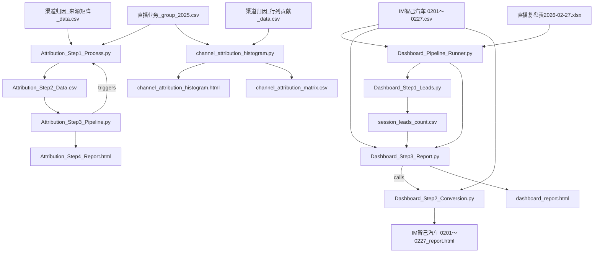

# 项目报告生成说明

本文档说明了项目生成的两个核心 HTML 报告的来源脚本及数据依赖。

## 1. 直播业务仪表盘 (`dashboard_report.html`)

该报告展示了直播业务的核心经济指标、规模敏感性分析、场景差异分析及投放边际收益分析。

- **生成脚本**: `/Users/zihao_/Documents/github/直播运营复盘/Dashboard_Step3_Report.py`
- **主要功能**:
  - 加载场次线索数据，计算核心指标（总场次、总消耗、CPL等）。
  - 执行三个维度的分析：规模敏感性、场景差异（大促vs日常）、边际收益。
  - 调用 `Dashboard_Step2_Conversion.py` 获取转化归因数据。
  - 生成包含 Plotly 图表和分析结论的综合仪表盘。
- **数据源**:
  1. **`session_leads_count.csv`**: 包含各直播场次的详细数据（如消耗、观看人数、线索量等）。
  2. **`IM智己汽车 0201～0227.csv`**: 用于转化归因分析的原始线索数据。

## 2. IM智己汽车转化分析报告 (`IM智己汽车 0201～0227_report.html`)

该报告深入分析了特定渠道（IM智己汽车）的用户转化路径、归因类型及影响力细分。

- **生成脚本**: `/Users/zihao_/Documents/github/直播运营复盘/Dashboard_Step2_Conversion.py`
  - 注意：该脚本通常被 `Dashboard_Step3_Report.py` 作为模块导入并调用，也可以独立运行（需视具体入口而定，但逻辑封装在此文件中）。
- **主要功能**:
  - **数据清洗与透视**: 将原始宽表或长表数据清洗并透视为以用户为中心的宽表。
  - **同类群组分析 (Cohort Analysis)**: 筛选 2026-02-01 至 2026-02-27 期间的“IM智己汽车”渠道用户。
  - **归因逻辑**:
    - **本渠道锁单**: 区分“直接锁单”（末次触点为IM）和“归因锁单”（末次触点非IM）。
    - **辅助锁单**: 区分“首触辅助”、“过程助攻”和“锁后触达”。
  - 生成包含 Mermaid 流程图和用户详细数据的 HTML 报告。
- **数据源**:
  - **`IM智己汽车 0201～0227.csv`**: 包含用户全链路触点数据的 CSV 文件。输出文件名是根据输入文件名自动生成的（`input_filename.csv` -> `input_filename_report.html`）。

## 3. 中间数据生成 (`session_leads_count.csv`)

此文件是 `Dashboard_Step3_Report.py` 的主要输入之一，包含了各直播场次的聚合数据。

- **生成脚本**: `/Users/zihao_/Documents/github/直播运营复盘/Dashboard_Step1_Leads.py`
- **主要功能**:
  - 将直播场次排期表与线索明细数据进行匹配。
  - 计算每场直播的实际线索量（Unique Leads）、CPL、CPLO 等衍生指标。
- **数据源**:
  1. **`直播复盘表2026-02-27.xlsx`**: 包含直播排期、时长、消耗、场观、商机数等基础数据。
  2. **`IM智己汽车 0201～0227.csv`**: 原始线索数据，用于按时间戳匹配到具体直播场次。

## 4. 自动化运行 (`Dashboard_Pipeline_Runner.py`)

为了简化操作，项目提供了 `Dashboard_Pipeline_Runner.py` 脚本，可一键串联上述所有步骤。

- **使用方法**:

  在终端中执行以下命令（支持相对路径或绝对路径）：

  ```bash
  python Dashboard_Pipeline_Runner.py --excel "source/直播复盘表2026-02-27.xlsx" --csv "source/IM智己汽车 0201～0227.csv"
  ```

- **参数说明**:
  - `--excel`: 直播复盘 Excel 文件路径（包含排期、消耗等基础数据）。
  - `--csv`: 原始线索 CSV 文件路径（包含用户触点明细）。

- **输出结果**:
  运行成功后，将自动生成以下文件：
  1. **Dashboard Report**: `dashboard_report.html` (位于项目根目录)
  2. **Conversion Report**: `source/IM智己汽车 0201～0227_report.html` (与输入 CSV 同级)
  3. **中间数据**: `source/session_leads_count.csv` (与输入 CSV 同级)

## 5. 渠道归因矩阵分析流程 (Attribution Analysis Pipeline)

该流程用于深度分析渠道间的助攻与锁单关系，生成助攻分布报告。

- **核心流程脚本**:
  1. **Step 1: 数据预处理 (`Attribution_Step1_Process.py`)**
     - **功能**: 读取原始归因矩阵数据，应用业务分组规则（由 `直播业务_group_2025.csv` 定义），将多个细分渠道归并为“直播业务(Group)”，并计算锁单数和助攻数。
     - **输入**: `渠道归因（来源矩阵)_data.csv`
     - **输出**: `Attribution_Step2_Data.csv` (清洗后的宽表数据)

  2. **Step 2: 自动化运行管线 (`Attribution_Step3_Pipeline.py`)**
     - **功能**: 作为主控脚本，它首先调用 Step 1 确保数据最新，然后读取 Step 2 的数据生成可视化报告。
     - **输入**: `Attribution_Step2_Data.csv`
     - **输出**: `Attribution_Step4_Report.html`

  3. **Step 4: 归因分析报告 (`Attribution_Step4_Report.html`)**
     - **内容**: 展示各助攻渠道的助攻占比分布（帕累托分析），识别关键助攻触点。

- **使用方法**:
  直接运行 Step 3 脚本即可自动触发全流程：
  ```bash
  python Attribution_Step3_Pipeline.py
  ```

## 6. 渠道助攻频数分布可视化 (Channel Attribution Histogram)

这是一个独立的分析模块，专注于可视化展示 Top 渠道的助攻流向矩阵。

- **生成脚本**: `/Users/zihao_/Documents/github/直播运营复盘/channel_attribution_histogram.py`
- **主要功能**:
  - 读取“行渠道给列渠道贡献”的矩阵数据。
  - 应用业务分组逻辑（依赖 `直播业务_group_2025.csv`）。
  - 生成分面直方图（Faceted Histogram），直观展示 Top 10 源渠道分别向哪些目标渠道提供了助攻。
- **数据源**:
  - **`渠道归因（行渠道给列渠道贡献了多少锁单用户）_data.csv`**: 包含详细的 Source -> Target 助攻数据。
  - **`直播业务_group_2025.csv`**: 定义直播业务渠道组的映射关系。
- **输出结果**:
  - **`channel_attribution_histogram.html`**: 交互式 HTML 图表。
  - **`channel_attribution_matrix.csv`**: 处理后的中间矩阵数据。

## 依赖关系总结


