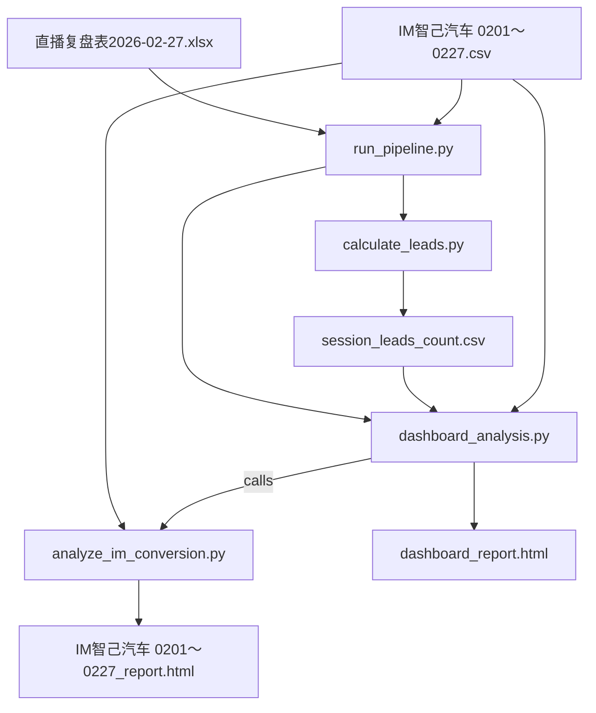

# 项目报告生成说明

本文档说明了项目生成的两个核心 HTML 报告的来源脚本及数据依赖。

## 1. 直播业务仪表盘 (`dashboard_report.html`)

该报告展示了直播业务的核心经济指标、规模敏感性分析、场景差异分析及投放边际收益分析。

- **生成脚本**: `/Users/zihao_/Documents/github/直播运营复盘/dashboard_analysis.py`
- **主要功能**:
  - 加载场次线索数据，计算核心指标（总场次、总消耗、CPL等）。
  - 执行三个维度的分析：规模敏感性、场景差异（大促vs日常）、边际收益。
  - 调用 `analyze_im_conversion.py` 获取转化归因数据。
  - 生成包含 Plotly 图表和分析结论的综合仪表盘。
- **数据源**:
  1. **`session_leads_count.csv`**: 包含各直播场次的详细数据（如消耗、观看人数、线索量等）。
  2. **`IM智己汽车 0201～0227.csv`**: 用于转化归因分析的原始线索数据。

## 2. IM智己汽车转化分析报告 (`IM智己汽车 0201～0227_report.html`)

该报告深入分析了特定渠道（IM智己汽车）的用户转化路径、归因类型及影响力细分。

- **生成脚本**: `/Users/zihao_/Documents/github/直播运营复盘/analyze_im_conversion.py`
  - 注意：该脚本通常被 `dashboard_analysis.py` 作为模块导入并调用，也可以独立运行（需视具体入口而定，但逻辑封装在此文件中）。
- **主要功能**:
  - **数据清洗与透视**: 将原始宽表或长表数据清洗并透视为以用户为中心的宽表。
  - **同类群组分析 (Cohort Analysis)**: 筛选 2026-02-01 至 2026-02-27 期间的“IM智己汽车”渠道用户。
  - **归因逻辑**:
    - **本渠道锁单**: 区分“直接锁单”（末次触点为IM）和“归因锁单”（末次触点非IM）。
    - **辅助锁单**: 区分“首触辅助”、“过程助攻”和“锁后触达”。
  - 生成包含 Mermaid 流程图和用户详细数据的 HTML 报告。
- **数据源**:
  - **`IM智己汽车 0201～0227.csv`**: 包含用户全链路触点数据的 CSV 文件。输出文件名是根据输入文件名自动生成的（`input_filename.csv` -> `input_filename_report.html`）。

## 3. 中间数据生成 (`session_leads_count.csv`)

此文件是 `dashboard_analysis.py` 的主要输入之一，包含了各直播场次的聚合数据。

- **生成脚本**: `/Users/zihao_/Documents/github/直播运营复盘/calculate_leads.py`
- **主要功能**:
  - 将直播场次排期表与线索明细数据进行匹配。
  - 计算每场直播的实际线索量（Unique Leads）、CPL、CPLO 等衍生指标。
- **数据源**:
  1. **`直播复盘表2026-02-27.xlsx`**: 包含直播排期、时长、消耗、场观、商机数等基础数据。
  2. **`IM智己汽车 0201～0227.csv`**: 原始线索数据，用于按时间戳匹配到具体直播场次。

## 4. 自动化运行 (`run_pipeline.py`)

为了简化操作，项目提供了 `run_pipeline.py` 脚本，可一键串联上述所有步骤。

- **使用方法**:

  在终端中执行以下命令（支持相对路径或绝对路径）：

  ```bash
  python run_pipeline.py --excel "source/直播复盘表2026-02-27.xlsx" --csv "source/IM智己汽车 0201～0227.csv"
  ```

- **参数说明**:
  - `--excel`: 直播复盘 Excel 文件路径（包含排期、消耗等基础数据）。
  - `--csv`: 原始线索 CSV 文件路径（包含用户触点明细）。

- **输出结果**:
  运行成功后，将自动生成以下文件：
  1. **Dashboard Report**: `dashboard_report.html` (位于项目根目录)
  2. **Conversion Report**: `source/IM智己汽车 0201～0227_report.html` (与输入 CSV 同级)
  3. **中间数据**: `source/session_leads_count.csv` (与输入 CSV 同级)

## 依赖关系总结


