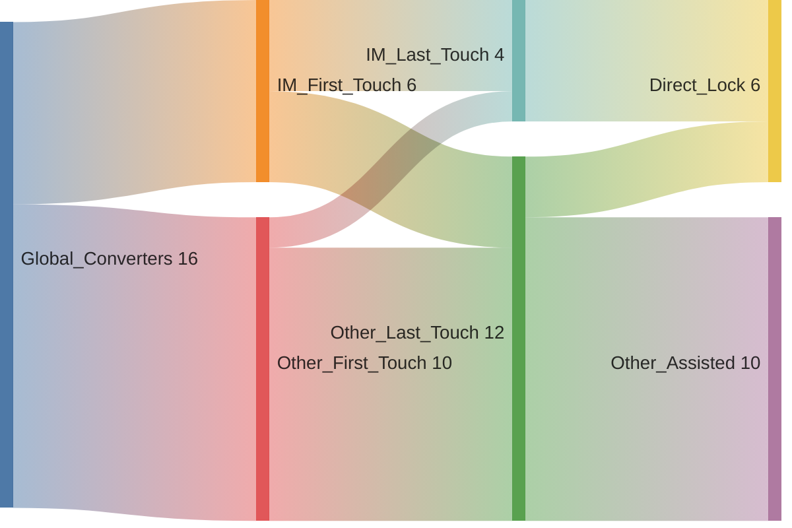
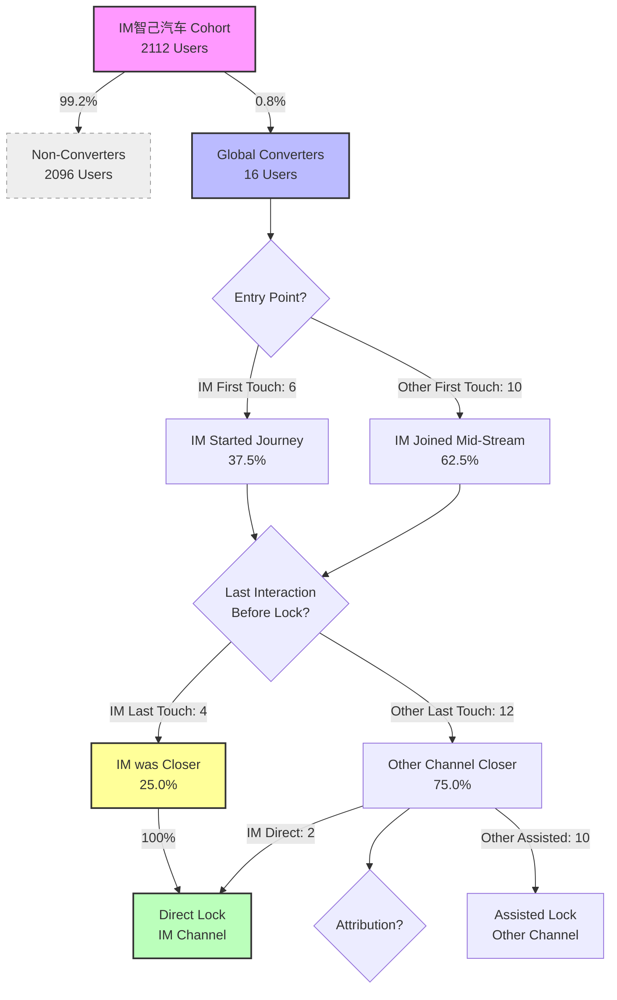

# IM智己汽车 User Conversion Flow (Feb 2026 Cohort)

## Flow Analysis (Based on Refined Last Touch Logic)

## 中英文术语对照表 (Terminology)

| 英文术语 (English Term)  | 中文术语 (Chinese Term) | 解释 (Explanation)                                                                                 |
| :----------------------- | :---------------------- | :------------------------------------------------------------------------------------------------- |
| **Cohort**               | 初始人群                | 本次分析选定的特定时间段（0201-0227）内新增的用户群体，共 2112 人。                                |
| **Global Converters**    | 全渠道锁单用户          | 在整个历史数据集中，无论通过哪个渠道，最终完成了锁单（Lock）的用户，共 16 人。                     |
| **Non-Converters**       | 未转化用户              | 在整个历史数据集中未产生锁单行为的用户。                                                           |
| **First Touch**          | 首次触点                | 用户在该品牌全生命周期中的第一次交互记录（最早的时间点）。                                         |
| **Last Touch**           | 末次触点                | 用户在产生“锁单”行为之前的最后一次交互记录（最晚的时间点，且必须早于锁单时间）。                   |
| **Direct Lock**          | 直接锁单                | 最终锁单归因于当前渠道（IM智己汽车），即该渠道是用户转化的直接来源。                               |
| **Assisted Lock**        | 辅助锁单                | 用户最终锁单了，但归因于其他渠道。当前渠道可能起到了辅助作用（如首次触点），但不是最终转化点。     |
| **Pivot (Long-to-Wide)** | 透视/转置（长改宽）     | 将原始数据中“一行一个度量”的长表格式，转换为“一行一个用户”的宽表格式，以便进行用户维度的聚合分析。 |
| **Data Sparse**          | 数据稀疏                | 指宽表中存在大量空值（NaN）的情况，例如并非所有用户都有锁单时间。                                  |
| **Attribution Logic**    | 归因逻辑                | 确定哪个渠道应该对用户的最终转化负责的规则（如：首次触点归因、末次触点归因）。                     |
